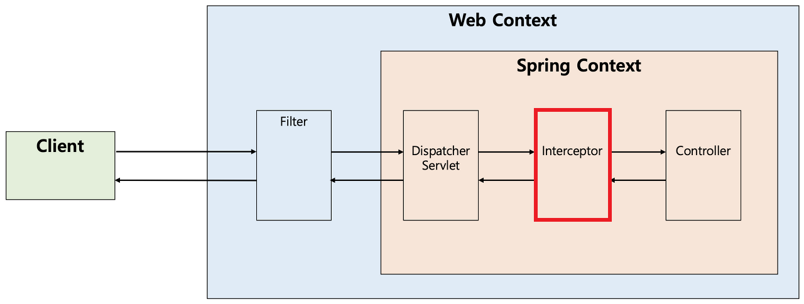

### 1. 문제 인식 및 정의

기존에 `ControllerAdvice`를 통해 예외를 처리하던 구조에서는 `Filter` 단계에서 발생하는 예외들을 처리하지 못하는 한계가 있었다.

특히, JWT 검증을 수행하는 필터(`JwtFilter`) 내에서 발생하는 예외는 Spring MVC의 DispatcherServlet 이전에 발생하기 때문에 `@RestControllerAdvice`로는 잡을 수 없었다.

---

### 2. 해결 방안

### 2-1. 의사결정 과정

해당 문제를 해결하기 위해 다음과 같은 여러 방안을 검토하였다.

1. **Interceptor를 통해 처리하기**

   → Interceptor는 DispatcherServlet 이후에 작동하기 때문에 필터 단계에서 발생한 예외는 처리할 수 없음.

2. **JwtFilter 내에서 직접 예외 처리하기**

   → 예외 처리 로직이 필터 내에 중복되고, 일관된 JSON 응답 포맷 유지가 어려움.

3. **예외 처리를 전담하는 필터를 하나 더 만들어 처리하기**

   → 필터 체인에서 가장 앞단에 등록하여, 이후 필터(JWTFilter 포함)에서 발생하는 예외를 catch하고, 공통된 방식으로 JSON 응답 반환 가능.

   → 유지 보수성과 확장성 측면에서 가장 적합한 방법으로 판단됨.


---

### 2-2. 해결 과정

- `JwtFilter`에서 발생하는 예외를 잡아주는 ErrorFilter 클래스를 추가로 구현함.
- 이 필터는 `FilterChain.doFilter()` 호출 시 try-catch로 감싸 이후 필터에서 발생하는 예외를 처리하도록 구성.
- 예외 발생 시 사용자에게 일관된 JSON 형식의 오류 응답을 반환함.
- ErrorFilter를 가장 앞선 필터로 등록하여, 모든 요청에서 예외를 우선적으로 처리하도록 필터 순서를 지정함.

---

### 3. 해결 완료
3-1. 회고



### 🔍 문제 인식

Filter는 **Servlet 컨테이너 수준**에서 동작하고, Interceptor는 **Spring 컨테이너 수준**에서 동작한다.

이 구조적 차이로 인해, **Filter 내에서 발생한 예외는 Spring의 `@ControllerAdvice`로 처리할 수 없다.**

내가 마주한 문제는 여기서 시작됐다:

**"Filter에서 발생한 예외를 어떻게 처리할 것인가?"**

---

### ❗ 한계 파악

`@ControllerAdvice`는 DispatcherServlet 이후, 즉 **Spring MVC 흐름 내**에서 발생하는 예외만 처리할 수 있다.

하지만 `Filter`는 그보다 앞단에 위치해 있어, 이 방식으로는 처리할 수 없다.

실제로 Filter에서 예외가 발생하면 해당 예외는 **Tomcat까지 전파**되어 `/error`로 리다이렉트된다고 한다.

책에서는 다루지 않아 확신이 없었지만, 구글링과 실험을 통해 흐름을 확인할 수 있었다.

---

### 🤔 해결 시도 및 의사결정

초기에는 이렇게 생각했다:

**"예외가 `/error`로 리다이렉트된다면, 인터셉터를 통해 처리할 수 있지 않을까?"**

그래서 `/error` 경로를 인터셉터로 잡아 `ExceptionInterceptor`를 만들어보았지만,

이 방식은 **Tomcat 내부에서 처리된 예외 응답 이후**의 흐름이라 내가 원하는 방식대로 개입하긴 어려웠다.

결국 이런 의문이 생겼다:

**"Filter에서 발생한 예외를 굳이 Spring 컨테이너까지 끌고 와야 할까?"**

---

### ✅ 최종 해결 방안

**핵심은 "예외 처리 책임을 필터 계층 안에서 분리"하는 것이었다.**

그래서 다음과 같이 구조를 변경했다:

1. **JWTFilter는 비즈니스 로직에 집중**하고,
2. **ExceptionHandlingFilter를 가장 앞단에 배치**하여 JWTFilter에서 발생하는 예외를 감싸고 처리.

### 3-2. 전후 데이터 비교

### JWT필터에서 발생하는 예외 형식

```json
{
    "timestamp": "2025-04-20T17:04:44.214+00:00",
    "status": 403,
    "error": "Forbidden",
    "path": "/admin/users/1"
}
```

### 다른 예외 응답 형식

```json
{
    "code": 400,
    "message": "가입되지 않은 유저입니다.",
    "status": "BAD_REQUEST"
}
```

### 필터 예외처리를 진행한 후

```json
{
    "code": 401,
    "message": "유효하지 않은 JWT 서명입니다.",
    "status": "UNAUTHORIZED"
}
```